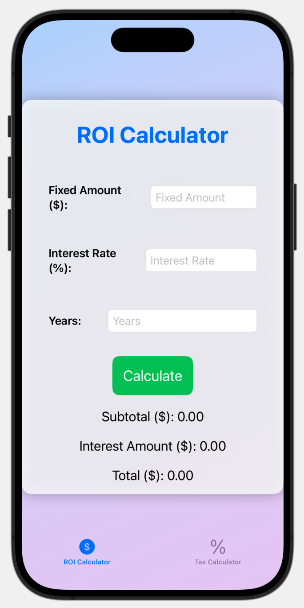

# ROI-Calc-iOS-Swift

## Demo

https://www.youtube.com/watch?v=e9UK9MSyArA&list=LL&index=2




## Features

- Developed a iOS app using Swift and SwiftUI for ROI and tax calculations, featuring interactive easy-to-use UIs for financial computations.


## Technology Used
- Swift programming language
- SwiftUI framework
- XCode IDE


## Run Locally

Clone the project

```bash
  git clone https://github.com/shubham-singh0109/ROI-Calc-iOS-Swift.git
```

Go to the project directory

```bash
  cd ROI-Calc-iOS-Swift
```


## Getting Started

Run the file "Contractor Calculator.xcodeproj" on XCode and start the iOS simulator device.
